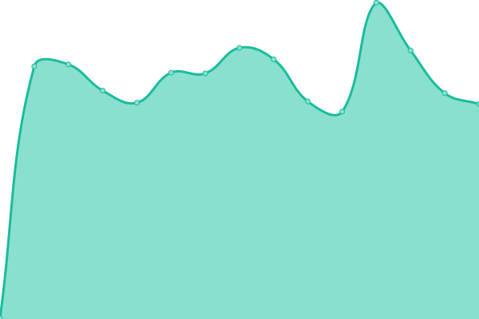

# [📈 Live Status](https://status.onetimesecret.com): <!--live status--> **🟩 All systems operational**

This repository contains the open-source uptime monitor and status page for [Onetime Secret](https://onetimesecret.com/), powered by [Upptime](https://github.com/upptime/upptime).

## Status Report

<!--start: status pages-->
<!-- This summary is generated by Upptime (https://github.com/upptime/upptime) -->
<!-- Do not edit this manually, your changes will be overwritten -->
<!-- prettier-ignore -->
| URL | Status | History | Response Time | Uptime |
| --- | ------ | ------- | ------------- | ------ |
|  [Homepage](https://onetimesecret.com/) | 🟩 Up | [homepage.yml](https://github.com/onetimesecret/status/commits/HEAD/history/homepage.yml) | 

 126ms
     
 | 

<a href="https://status.onetimesecret.com/history/homepage">100.00%</a>
    

|  [API Status (v1)](https://eu.onetimesecret.com/api/v1/status) | 🟩 Up | [api-status-v1.yml](https://github.com/onetimesecret/status/commits/HEAD/history/api-status-v1.yml) | 

 319ms
     
 | 

<a href="https://status.onetimesecret.com/history/api-status-v1">100.00%</a>
    

|  [API Status (v2)](https://eu.onetimesecret.com/api/v2/status) | 🟩 Up | [api-status-v2.yml](https://github.com/onetimesecret/status/commits/HEAD/history/api-status-v2.yml) | 

 135ms
     
 | 

<a href="https://status.onetimesecret.com/history/api-status-v2">100.00%</a>
    

|  [API - Create secret](https://eu.onetimesecret.com/api/v1/share) | 🟩 Up | [api-create-secret.yml](https://github.com/onetimesecret/status/commits/HEAD/history/api-create-secret.yml) | 

 365ms
     
 | 

<a href="https://status.onetimesecret.com/history/api-create-secret">100.00%</a>
    

|  [API - Create secret](https://eu.onetimesecret.com/api/v2/secret/conceal) | 🟩 Up | [api-create-secret.yml](https://github.com/onetimesecret/status/commits/HEAD/history/api-create-secret.yml) | 

 365ms
     
 | 

<a href="https://status.onetimesecret.com/history/api-create-secret">100.00%</a>
    

|  [Identity Plus (EU)](https://eu.onetimesecret.com/) | 🟩 Up | [identity-plus-eu.yml](https://github.com/onetimesecret/status/commits/HEAD/history/identity-plus-eu.yml) | 

 152ms
     
 | 

<a href="https://status.onetimesecret.com/history/identity-plus-eu">100.00%</a>
    

|  [Identity Plus (CA)](https://ca.onetimesecret.com/) | 🟩 Up | [identity-plus-ca.yml](https://github.com/onetimesecret/status/commits/HEAD/history/identity-plus-ca.yml) | 

 187ms
     
 | 

<a href="https://status.onetimesecret.com/history/identity-plus-ca">100.00%</a>
    

|  [Identity Plus (US)](https://us.onetimesecret.com/) | 🟩 Up | [identity-plus-us.yml](https://github.com/onetimesecret/status/commits/HEAD/history/identity-plus-us.yml) | 

 310ms
     
 | 

<a href="https://status.onetimesecret.com/history/identity-plus-us">100.00%</a>
    

<!--end: status pages-->

[**Visit our status website →**](https://status.onetimesecret.com)

### 📄 About Upptime

With [Upptime](https://upptime.js.org), you can get your own unlimited and free uptime monitor and status page, powered entirely by a GitHub repository. We use [Issues](https://github.com/onetimesecret/status/issues) as incident reports, [Actions](https://github.com/onetimesecret/status/actions) as uptime monitors, and [Pages](https://status.onetimesecret.com) for the status page.

- Code: [MIT](./LICENSE) © [Anand Chowdhary](https://anandchowdhary.com)
